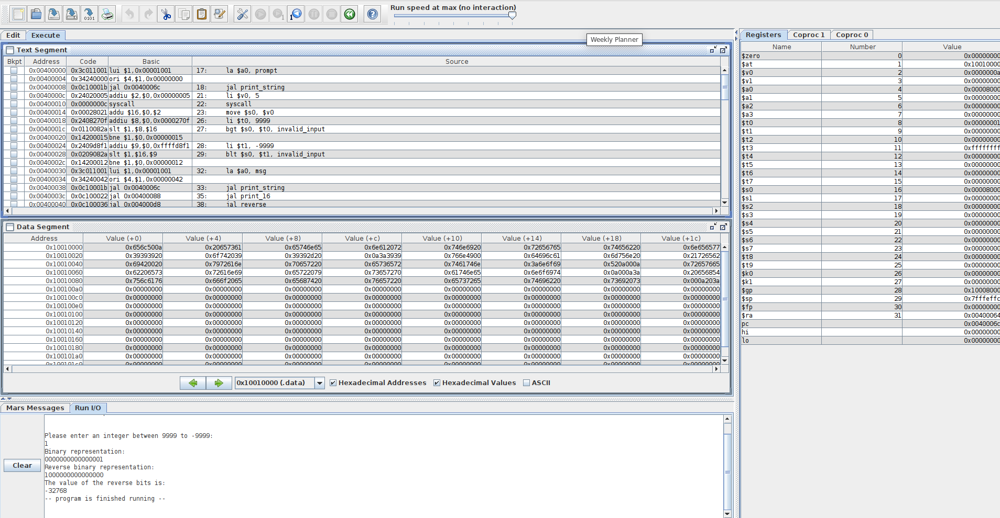

# Binary Representation and Reversal

This repository contains an assembly program for MIPS architecture that takes an integer input within the range of -9999 to 9999 and performs the following operations:

1. Prints the binary representation of the lower 16 bits of the input.
2. Prints the reverse binary representation of the lower 16 bits.
3. Prints the decimal value of the reversed lower 16 bits.

## Assembly Code Overview

### Data Section:

- **Prompt and Messages:**
  - `prompt`: Prompt to instruct the user to enter an integer.
  - `err_msg`: Error message for an invalid input.
  - `msg`: Message for binary representation.
  - `rev_msg`: Message for reverse binary representation.
  - `val_msg`: Message for the value of reversed bits.

### Text Section:

- **Main Program Logic:**
  - Reads an integer input within the specified range.
  - Prints the binary representation of the lower 16 bits.
  - Reverses the lower 16 bits and prints the reverse binary representation.
  - Prints the decimal value of the reversed lower 16 bits.

- **Functions:**
  - `print_string`: Prints a string loaded in `$a0`.
  - `print_16`: Prints the binary representation of the lower 16 bits.
  - `reverse`: Reverses the lower 16 bits.
  - `print_number`: Prints the decimal value of the lower 16 bits.

- **Input Validation:**
  - Checks if the entered integer is within the range of -9999 to 9999.

## How to Use

1. **Compilation:**
   - Assemble the code using a MIPS assembler.
   - Link the object file to create an executable.

2. **Execution:**
   - Run the compiled executable on a MIPS emulator or compatible hardware.

3. **Usage:**
   - Follow the on-screen instructions to enter an integer within the specified range.
   

